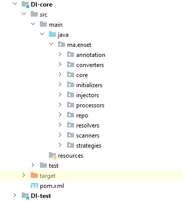
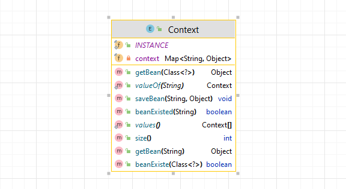
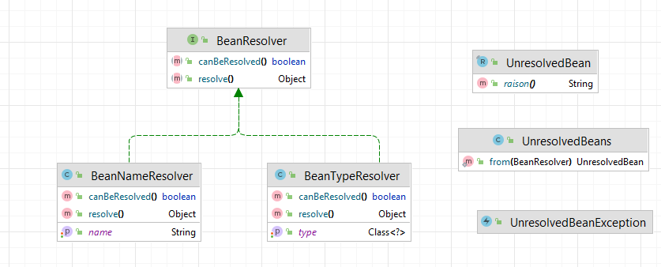
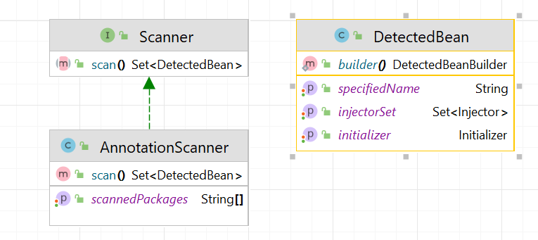
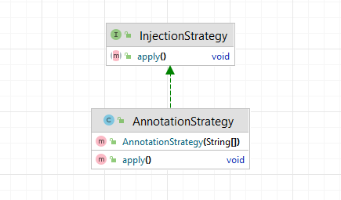
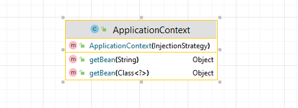

# Framework d'injection de dependances basé sur les annotations

## Le but
Le but de cette partie est de créer un framework comme spring qui permet de faire
**l'injection des dépendances**, à travers plusieurs **annotations** qu'on a créées.


## La structure de projet

Notre projet est divisé sur deux modules :
* le premier module `DI-core` qui contient l'implémentation du framework.
* le second module `DI-test` pour tester notre solution sur un cas réél.

```xml
    <modules>
        <module>DI-core</module>
        <module>DI-test</module>
    </modules>
```


## Module DI-core 

Dans ce module, on a essayé d'implémenter une solution qui permet 
de faire l'injection des dépendances, ce module est organisé comme ceci :



### package annotations
Commencant par le package des `annotations`, on a créé plusieurs annotations 
qui seront détectées au moment d'exécution, ces annotations sont :

* `@Component` : cette annotation est destinée aux classes, que l'on souhaite les instancier, on peut spécifier le nom du bean qui sera créé :
```java
    @Target(METHOD)
    @Retention(RUNTIME)
    public @interface Bean {
        String value() default "";
    }
```
* `@BeansFactory`: cette annotation est similaire de l'annotation `@Configuration` du **spring** s'applique également aux classes, 
    ces classes vont contient des méthodes spécifiques (annoté par `@Bean`) qui vont applés au moment du démarrage de l'application
    pour créer des nouveaux beans, En général, on utilise ce genre d'instanciation pour les classes qui 
    sont déja définis et qu'on ne peut pas les ajoutées l'annotation `@Component`.
```java
    @Target(TYPE)
    @Retention(RUNTIME)
    public @interface BeansFactory {
    }


```
* `@Bean`: équivalent de l'annotation `@Bean` celle de **Spring**, elle permet de créer des beans en exécutant la méthode annotée, 
    le nom du bean sera le nom passé en paramètre de l'annotation, 
    sinon le nom du bean sera le nom de la méthode, ainsi le type du bean sera le type de retour de la méthode, on peut spécifier le nom du bean :
```java
    @Target(METHOD)
    @Retention(RUNTIME)
    public @interface Bean {
        String value() default "";
    }

```

* `@inject`: cette annotation permet d'injecter des beans dans les éléments annotés, qui sont :
    - les constructeurs
    - les attribus
    - les setters
```java
    @Target({FIELD, CONSTRUCTOR, METHOD})
    @Retention(RUNTIME)
    public @interface Inject {
    }
```
* `@Prefer`: cette annotation peut etre utilisé avec `@Inject`, pour favoriser ou spécifier qu'il est le bean
  (en donnant le nom du bean en paramètre) :
```java
    @Target({FIELD, PARAMETER})
    @Retention(RUNTIME)
    public @interface Prefer {
        String value();
    }
```


### package repository

Dans ce package, on a essayé d'implémenter `le pattern singleton` 
pour avoir une sorte d'une base de donnés dans 
laquelle les beans créés seront stocké, on sait bien que 
la meilleure facon d'implémenter le modèle singleton ce sont des `Enumérations`, car elles permettent
de bien controller le nombre des instances qu'on veut dans notre application :



* `INSTANCE`: la seule instance qu'on a créée :
* `context`: c'est un attribut de type `Map<String, Object>`:
```java
    private final Map<String, Object> context = new ConcurrentHashMap<>();
```
* les autres méthodes comme : `size()` `saveBean(...)`, `beanExist(...)`, `getBean(...)`: pour manipuler l'attribut context.

### package resolvers



Ce package contient l'interface `BeanResolver`
qui permet de faire la résolution d'un bean à l'aide de son nom, ou son type 
(trouver un bean qui a le meme type ou un sous type de type déclaré), 
c'est le role de la méthode `resolve`
,aussi, elle permet de tester l'existence d'un bean dans notre repository Context, 
c'est le role de la méthode `canBeResolved`:

```java
    public interface BeanResolver {
        Object resolve();
        boolean canBeResolved();
    }
```


L'importance de cette interface qu'elle résout le problème d'identification des beans, c'est pour cela, on distingue deux
implémentations de cette interface :
* `BeanNameResolver` : qui permet d'identifier un bean a l'aide d'un nom.
* `BeanTypeResolver`: qui permet d'identifier un bean par un type, on peut accepter n'import
    qu'il bean de meme type ou d'un sous type :

L'interface `BeanResolver` est comme un promèsse ou pointeur sur un bean dans `Context Repository`, et lorsqu'on aura
besoin de ce bean et qu'il est disponible (`canBeResolver()` retournera true), il suffit juste d'invoquer `resolve()`
ces implémentations sont liées directement à notre `Context Repository`.

Le package contient aussi l'enregistrement `UnresolvedBean` qui est de type `record`, c'est un object immuable
sert juste à stocker la raison pour laquelle le bean n'est pas résolu :

```java
    public record UnresolvedBean(String raison) {}
```

La classe `UnresolvedBeans` est une classe `Factory` qui permit de convertir un `BeanResolver` vers une instance de type 
`UnresolvedBean`:


```java

public class UnresolvedBeans {
    private static String UNRESOLVED_BEAN_NAME = "unresolved bean with name: ";
    private static String UNRESOLVED_BEAN_TYPE = "unresolved bean with type: ";

    public static UnresolvedBean from(BeanResolver beanResolver){
        if (beanResolver instanceof BeanNameResolver beanNameResolver)
            return new UnresolvedBean(UNRESOLVED_BEAN_NAME + beanNameResolver.getName());
        return new UnresolvedBean(UNRESOLVED_BEAN_TYPE + ((BeanTypeResolver) beanResolver).getType().getName());
    }
}
```

`UnresolvedBeanException` est une classe aui modelise l'exception qui sera jete si le bean n'est pas trouvé au cours d'initialiser ou d'injection des autres bean dont qu'ils dépendent :
```java
    public class UnresolvedBeanException extends RuntimeException{
    
        public UnresolvedBeanException(UnresolvedBean unresolvedBean) {
            super(unresolvedBean.raison());
        }
    }

```


### packages injectors

Ce package contient :


* l'interface `Injector` permet de modéliser l'action d'injection d'un 
    bean dans un champ specifique, à travers un setter ou injection par attribut (field)

  cette interface dispose des méthodes suivantes :
    - `inject` : injecter un bean dans un `champs`.
    - `canBeInjected` : vérifie si la dépendance est satisfaite, c'est-a-dire que le bean que l'on veut l'injecter est existé au niveau du `Context` repository.
    - `findFirstUnresolvedBean` : permet de retourner le premier bean qui n'existe pas dans le `Context` repo, encapsuler d'un enregistrement `UnresolvedBean`.

Pour reqliser cette interface, on a cree deux implementations :
* `FieldInjector` : qui modélise l'injection par attribut.
* `SetterInjector` : qui modélise l'injection par setter.

Dans ce package aussi, on dispose de la classe factory `Injectors` qui permet de creer un des object de type `Injector` 
on lui fournit des paramètres qui conviennent.


### package initializer


On a dit que le package `injectors` est mise en place pour implementer l'injection par setter ou par attribut (Field),
d'abord, il faut comprendre une chose, ce que l'injection par setter ou par attribut s'effectue apres l'initialisation du bean,
est tres facile à faire si les beans à injecter sont tous prêts, mais le probleme se provoque si l'injection se faite via
un constructeur (ou une methode annotée par l'annotation `@Bean`), pour cela, on a utilisé le modèle illustré dans le diagramme de classe 
precedent.

* `Initializer` : est une interface qui modélise l'injection des dépendances au moment de l'initialisation des classes via la methode `initialize`,
    la methode `canBeInitialized` c'est pour vérifier est-ce que toutes les dépendances sont bien établis ou pas,
    la methode `findFirstUnresolvedBean` a pour effet comme celle des injecteurs (définit dans l'interface `Injector`).
* pour la realisation de cette interface, on distingue deux types d'implémentation :
    - `SimpleInitializer` : classe abstraite qui reflète les constructeurs sans paramètres et qui ont annoté par `@Inject`, ou les méthodes annotées par `@Bean` définissant dans les classes annotées 
        par l'annotation `@BeansFactory` et qui ne reçoivent aucun paramètre.
        on a distingué deux types des initialisations simples : `SimpleConstructorInitializer` et `SimpleMethodInitializer`.
    - `ParametricInitializer` : aussi, c'est une classe abstraite, et comme son nom montre, il diffère a `SimpleInitializer` par la presence d'un ensemble des paramètres.
        on a distingué deux types des initialisations paramétriques : `ParametricConstructorInitializer` et `ParametricMethodInitializer`.

* `Initalizers` : est une classe factory pour parser un initializer à partir des classes et des méthodes annotées.


### package scanners



* `DetectedBean` : c'est la classe qui modélise un bean qui est détecté au moment du scanning :

    

    - `specifiedName` : le nom passé paramètre du `@Component`, sinon le nom de la classe annoté par `@Component` décapitalisé
      ou le nom spécifié en paramètre du `@Bean`, sinon le nom de la méthode annotée  `@Bean`.
    - `initializer` : constructeur ou une méthode qui permet de cree un objet qui représente le bean.
    -  `injectorSet` : l'ensemble des injections à faire après l'initialisation du bean.


* L'interface `Scanner` qui fourni la méthode `scan` qui permet de faire le scanning en cherchant des beans à instancier, ou à l'injecter,
la méthode `scan` nous retourne une `Set<DetectedBean>` l'ensemble des beans détectés.
pour la réalisation de cette interface, on peut créer deux implémentations :
  -`AnnotationScanner` : qui parcourt l'ensemble des packages à scanner qui seront precisés par l'attribut `scannedPackages`, 
      pour le scanning, on a utilisé l'outil `Reflections` fourni par la dépendance :
```xml
      <dependency>
          <groupId>org.reflections</groupId>
          <artifactId>reflections</artifactId>
          <version>0.10.2</version>
      </dependency>
```
   - par extension (**car notre implémentation est fermée à la modification est ouverte à l'extension**) en peut ajouter une implémentation de `XMLScanner` qui va dépendre d'un fichier XML, dans lequel on a défini
        l'ensemble des beans a créé et injecté.
    
### package strategies



* `InjectionStrategy` : représente la stratégie utilisée pour efféctuer l'injection des dépendances
    il contient la méthode `apply`, qui lance le process de la stratégie.

On peut distinguer deux stratégies d'injection des dépendances :
* `AnnotationStrategy` : le scan va utiliser un scanner de type `AnnotationScanner`.
* `XMLStrategy` : le scan va utiliser un scanner de type `XMLScanner`.

### package converters


 C'est une classe Factory qui permet de convertir des classes et des méthodes annotées qui sont détectées au moment du scan,
    les convertir en `DetectedBean` objet.

### package core



`ApplicationContext` : c'est le point d'entrée pour avoir utilisé notre solution, qui utilise une 
    `InjectionStrategy`, et qui fourni deux méthodes surchargées : `getBean` par nom ou par type.


## Module DI-test

Dans ce module, on a créé un test pour notre solution d'injection des dépendances.
Commencant par ajouter la dépendance au module `DI-core` :

```xml
    <dependencies>
        <dependency>
            <groupId>ma.enset</groupId>
            <artifactId>DI-core</artifactId>
            <version>1.0-SNAPSHOT</version>
        </dependency>
    </dependencies>

```

La structure de module est très simple :


* dans la classe `Conifg` on a :
```java
        @BeansFactory
        public class Config {
        
            @Bean("ti")
            public double initialTemp(){
                return 1000.;
            }
        
            @Bean("tf")
            public double finalTemp(){
                return 50000.;
            }
        }

   ```

  * dans le package Dao, on a créé deux implémentations de l'interface `IDao`:
      - `IDao` : 
```java
            public interface IDao {
                double getData();
            }
```
        
      - `DaoImpl` :
```java
          @Component("dao1")
          public class DaoImpl implements IDao{
            @Override
            public double getData() {
              System.out.println("dao version 1");
              return 100;
            }
          }
```
      - `DaoImplV2` : 
```java
        @Component("dao2")
        public class DaoImplV2 implements IDao{
            @Override
            public double getData() {
                System.out.println("dao version 2");
                return 200;
            }
        }
```


* dans le package metier :

    - `IMetier` : 
```java
public interface IMetier {
    double calculate();
}
```

    - `MetierImpl` :
```java
@Component
public class MetierImpl implements IMetier{
    @Inject
    @Prefer("dao2")
    private IDao dao;
    @Inject
    @Prefer("ti")
    private Double temp;

    public void setDao( IDao dao){
        this.dao = dao;
    }

    @Override
    public double calculate() {
        return dao.getData() * temp;
    }
}

```

* dans l'interface `Main` de notre application :

```java
public interface Main {
     static void main(String[] args) {

        ApplicationContext context = new ApplicationContext(new AnnotationStrategy("ma.enset"));

        IMetier iMetier = (IMetier) context.getBean(IMetier.class);
        System.out.println("data: " + iMetier.calculate());

    }
}
```

* Le résultat est :


* Vérification : 
    - pour le bean temp dans la classe `MetierImpl` on a favorisé le bean `ti`.
    - pour le bean dao dans la classe `MetierImpl` on a privilégié le bean `dao2`.
    - le bean `ti` est de type Double contient la valeur 1000
    - la méthode `getData` renvoie la valeur 200 pour le bean `dao2`
    - est donc 1000 * 200 = 200_000
